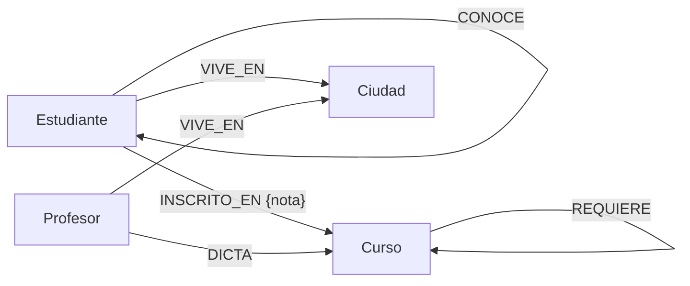
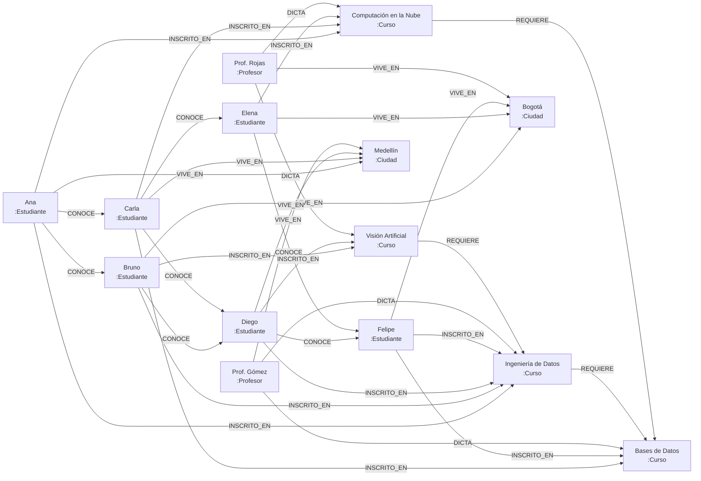

# Modelo del grafo

## Esquema (tipos de vértice y relación)

```mermaid
graph LR
  Estudiante -- CONOCE --> Estudiante
  Estudiante -- "INSCRITO_EN {nota}" --> Curso
  Profesor -- DICTA --> Curso
  Curso -- REQUIERE --> Curso
  Estudiante -- VIVE_EN --> Ciudad
  Profesor -- VIVE_EN --> Ciudad
```

## Instancia (datos cargados)

```mermaid
graph LR
  e1["Ana<br/>:Estudiante"]
  e2["Bruno<br/>:Estudiante"]
  e3["Carla<br/>:Estudiante"]
  e4["Diego<br/>:Estudiante"]
  e5["Elena<br/>:Estudiante"]
  e6["Felipe<br/>:Estudiante"]
  p1["Prof. Gómez<br/>:Profesor"]
  p2["Prof. Rojas<br/>:Profesor"]
  c1["Bases de Datos<br/>:Curso"]
  c2["Ingeniería de Datos<br/>:Curso"]
  c3["Computación en la Nube<br/>:Curso"]
  c4["Visión Artificial<br/>:Curso"]
  m["Medellín<br/>:Ciudad"]
  b["Bogotá<br/>:Ciudad"]
  e1 -- CONOCE --> e2
  e1 -- CONOCE --> e3
  e2 -- CONOCE --> e4
  e3 -- CONOCE --> e5
  e4 -- CONOCE --> e6
  e5 -- CONOCE --> e6
  e3 -- CONOCE --> e4
  e1 -- INSCRITO_EN --> c2
  e1 -- INSCRITO_EN --> c3
  e2 -- INSCRITO_EN --> c2
  e2 -- INSCRITO_EN --> c4
  e3 -- INSCRITO_EN --> c1
  e3 -- INSCRITO_EN --> c3
  e4 -- INSCRITO_EN --> c2
  e4 -- INSCRITO_EN --> c4
  e5 -- INSCRITO_EN --> c3
  e6 -- INSCRITO_EN --> c1
  e6 -- INSCRITO_EN --> c2
  p1 -- DICTA --> c1
  p1 -- DICTA --> c2
  p2 -- DICTA --> c3
  p2 -- DICTA --> c4
  c2 -- REQUIERE --> c1
  c3 -- REQUIERE --> c1
  c4 -- REQUIERE --> c2
  e1 -- VIVE_EN --> m
  e2 -- VIVE_EN --> b
  e3 -- VIVE_EN --> m
  e4 -- VIVE_EN --> m
  e5 -- VIVE_EN --> b
  e6 -- VIVE_EN --> b
  p1 -- VIVE_EN --> m
  p2 -- VIVE_EN --> b
```

Vértices: 14 | Aristas: 33
